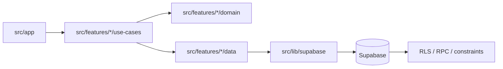
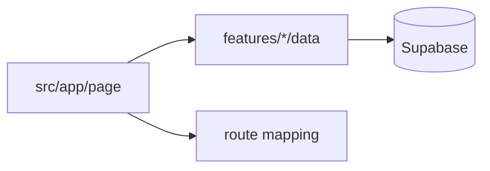
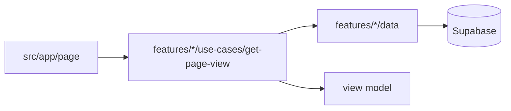

# Auditoria De Arquitectura - GlowBook

Fecha: 2026-05-29

## Proposito

Este documento audita el estado actual de GlowBook como monolito modular feature-first. El objetivo es revisar organizacion de carpetas, separacion de responsabilidades, deuda tecnica, cumplimiento de SOLID y calidad de los Seams entre `app`, `features`, `components`, `lib` y Supabase.

La auditoria usa el vocabulario de la skill `improve-codebase-architecture`:

- **Module**: unidad con Interface e Implementation.
- **Interface**: lo que un caller debe saber para usar el Module.
- **Implementation**: codigo interno.
- **Depth**: mucho comportamiento detras de una Interface pequena.
- **Seam**: punto donde vive una Interface.
- **Adapter**: Implementation concreta detras de un Seam.
- **Leverage**: valor que reciben callers y tests.
- **Locality**: cambios y bugs concentrados en un lugar.

## Resumen Ejecutivo

GlowBook ya tiene una direccion arquitectonica correcta para un SaaS multi-tenant: monolito modular, feature-first, con Supabase como Adapter de persistencia y seguridad. La arquitectura esta bastante mejor implementada que una app Next.js route-first comun.

Evaluacion general: **8/10**.

Fortalezas principales:

- El vocabulario de dominio esta consolidado en `CONTEXT.md`.
- ADR 0009 define claramente `app -> features/use-cases -> domain + data`.
- ADR 0010 limita `service_role` a Adapters autorizados.
- `docs/database-contracts.md` mapea SQL/RLS/RPC/constraints a owners TypeScript.
- `features/appointments`, `features/employees`, `features/platform`, `features/reports`, `features/salon` y `features/reminders` tienen buena Locality.
- Los guardrails automaticos existen en `scripts/check-architecture.mjs` y pasan.
- Hay tests sobre Modules profundos y use-cases criticos.

Riesgos principales:

- Algunas paginas en `src/app` todavia importan repositorios `data` directamente para lecturas. No es critico, pero reduce consistencia del monolito modular.
- Algunos use-cases de `features/appointments` todavia crean Supabase clients directamente. Funcionan, pero mezclan orquestacion de negocio con Adapter SQL.
- Persisten carpetas `domain` vacias en `features/platform` y `features/services`.
- `components/layout` importa tipos y schemas de `features`, lo cual esta permitido parcialmente, pero puede volver el layout menos portable si crece.
- Varias pantallas UI route-local son grandes. No necesariamente incorrecto, pero conviene vigilar que no absorban reglas de negocio.

Top recommendation: **crear Modules de lectura/use-cases para las paginas que aun importan `data` directamente desde `app`**. Es el siguiente paso con mayor Leverage y menor riesgo.

Roadmap derivado: `docs/architecture-audit-phases-2026-05-29.md`.

## Arquitectura Actual

GlowBook usa esta arquitectura objetivo:

```text
src/app
  -> Next routes, layouts, pages, Server Actions, UI route-local

src/features/<dominio>
  -> schemas.ts
  -> domain      # reglas puras
  -> data        # Adapter Supabase/Postgres
  -> use-cases   # Interface de negocio para app

src/components
  -> ui          # UI generica
  -> layout      # layout compartido

src/lib
  -> auth, Supabase Adapters, utils, validation, Result

supabase/migrations
  -> schema, RLS, RPCs, triggers, constraints
```

Flujo esperado:



Estado real:

- El flujo se cumple bien en comandos y lecturas complejas.
- Todavia hay excepciones en lecturas simples desde paginas hacia `features/*/data`.
- Hay algunos use-cases de citas que hacen I/O directo en lugar de usar un Adapter `data`.
- `domain` esta protegido por guardrail y no importa Next, React ni Supabase.

## Cumplimiento SOLID

| Principio | Estado | Evaluacion |
|---|---|---|
| SRP | Bueno | La mayoria de features tienen responsabilidades claras. Aun quedan paginas que mezclan render con lectura. |
| OCP | Medio-alto | Los Modules profundos permiten extender comportamiento sin tocar rutas. Los estados de cita y permisos estan centralizados. |
| LSP | No aplica fuerte | No hay jerarquias de clases relevantes. Bien: no se introdujeron abstracciones innecesarias. |
| ISP | Bueno | Interfaces son pequenas en use-cases y dominio. Riesgo: algunos repos exponen muchas funciones en un solo archivo. |
| DIP | Medio | `app` depende de use-cases en muchos flujos, pero aun depende de `data` en lecturas. Use-cases de appointments dependen directo de Supabase en algunos casos. |

Conclusion SOLID: la base es sana. El mayor trabajo pendiente es profundizar Interfaces de lectura y reducir dependencias directas a Adapters desde `app`.

## Auditoria Carpeta Por Carpeta

## Root Del Proyecto

Archivos relevantes:

- `README.md`
- `CONTEXT.md`
- `package.json`
- `tsconfig.json`
- `eslint.config.mjs`
- `vitest.config.ts`
- `next.config.ts`
- `.env.local.example`

Estado: **bueno**.

Lo bueno:

- `README.md` ya explica arquitectura real, comandos y decisiones clave.
- `CONTEXT.md` contiene el vocabulario de dominio estable.
- `package.json` tiene scripts de verificacion completos: `test`, `type-check`, `lint`, `build`, `architecture:check`.
- `vitest.config.ts` resuelve `@` y mockea `server-only` para tests.

Friccion:

- La auditoria y roadmap viven en docs, pero no hay un indice unico de "estado actual de arquitectura" que apunte al ultimo reporte. Esta auditoria cubre eso, pero convendria mantenerla como referencia.
- `tsconfig.tsbuildinfo` aparece en el root. Si esta trackeado por git, deberia salir del repo; si solo esta local, no hay problema.

Recomendacion:

- Mantener `CONTEXT.md` como contrato de lenguaje obligatorio.
- Revisar que `tsconfig.tsbuildinfo` este ignorado.
- Agregar un enlace desde `README.md` a este reporte si se quiere usar como auditoria viva.

## `docs/`

Contenido:

- `docs/adr/`
- `docs/architecture-audit.md`
- `docs/architecture-audit-2026-05-29.md`
- `docs/database-contracts.md`
- `docs/modular-monolith-roadmap.md`

Estado: **muy bueno**.

Lo bueno:

- Hay ADRs para decisiones importantes: RLS, appointment items, RBAC, archivado, onboarding, eliminacion completa de Salon, plantillas, tests, monolito modular y `service_role`.
- `database-contracts.md` mapea SQL a owners TypeScript.
- `modular-monolith-roadmap.md` registra fases implementadas.

Friccion:

- Existen dos auditorias: la historica y esta. Eso esta bien si se entiende como "foto anterior" y "foto actual". Si no, puede confundir.
- Algunos documentos mezclan ingles y espanol. No rompe arquitectura, pero baja uniformidad.

Recomendacion:

- Mantener `docs/architecture-audit.md` como historico y esta auditoria como estado actual.
- En futuras fases, actualizar `database-contracts.md` cuando se cambie SQL o ownership de dominio.

## `scripts/`

Contenido:

- `bootstrap-platform-admin.mjs`
- `check-architecture.mjs`

Estado: **bueno**.

Lo bueno:

- `bootstrap-platform-admin.mjs` concentra bootstrap de plataforma fuera de la app.
- `check-architecture.mjs` es un guardrail real y ejecutable.
- `npm run lint` ya ejecuta el guardrail.

Friccion:

- El guardrail cubre reglas criticas, pero no bloquea aun imports directos desde `app` hacia `features/*/data`.
- Tampoco valida que carpetas `domain` vacias no existan.

Recomendacion:

- Extender `check-architecture.mjs` en una fase corta para advertir o bloquear:
  - `src/app` importando `features/*/data`, salvo allowlist temporal.
  - carpetas vacias sin README.
  - use-cases que importan `createSupabaseServerClient` cuando deberian pasar por `data`.

## `supabase/`

Contenido:

- `config.toml`
- `migrations/20240101000000` a `20240101000026`

Estado: **muy bueno**.

Lo bueno:

- Supabase no se usa solo como persistencia; es Adapter de seguridad con RLS, RPCs, triggers y constraints.
- `create_appointment` concentra escritura atomica de citas.
- `delete_salon_completely` concentra eliminacion transaccional.
- `platform_salon_overviews()` reduce N+1 en Plataforma.
- Existen constraints para integridad same-Salon.

Friccion:

- Hay bastante logica duplicada en TypeScript para UX y SQL para autoridad final. Esta duplicacion esta documentada, pero requiere disciplina.
- RLS y RPCs dependen de tipos generados; cada cambio de schema debe regenerar `src/types/database.types.ts`.

Recomendacion:

- Mantener `docs/database-contracts.md` como checklist obligatorio antes de tocar SQL.
- Agregar tests de integracion selectivos para RLS de features criticas si el proyecto crece.

## `src/app/`

Estado general: **bueno, con deuda controlada**.

Rol correcto:

- Delivery Interface de Next.js.
- Auth, permission, parseo de input, llamada a use-case y render.

Lo bueno:

- Las rutas estan organizadas por areas de producto.
- Server Actions importantes ya llaman use-cases.
- Reportes, agenda, wizard, dashboard y recordatorios fueron extraidos a Modules de lectura.
- La UI route-local esta contenida dentro de cada ruta.

Friccion:

- Hay paginas que importan repositorios `data` directamente:
  - `services/page.tsx`
  - `salon/page.tsx`
  - `customers/page.tsx`
  - `plantillas/page.tsx`
  - `roles/page.tsx`
  - `employees/page.tsx`
  - `employees/[id]/page.tsx`
  - `appointments/[id]/page.tsx`
  - paginas de Plataforma como `admin/page.tsx`, `admin/reports/page.tsx`, `admin/salons/page.tsx`
- `dashboard/layout.tsx`, `appointments/[id]/page.tsx` y `employees/[id]/page.tsx` todavia crean Supabase clients directamente para lecturas puntuales.
- Algunas pantallas UI son grandes:
  - `salon-settings.tsx`
  - `appointments-calendar.tsx`
  - `services-manager.tsx`
  - `appointments-day-view.tsx`
  - `reminders-view.tsx`

Evaluacion:

- No hay un incendio arquitectonico. La mayoria de esta deuda es de consistencia.
- El riesgo aparece cuando una pagina con lectura directa empieza a agregar transformaciones, permisos o reglas.

Recomendacion:

- Crear use-cases de lectura para paginas que aun importan `data`.
- Mantener UI route-local cuando sea puramente presentacional.
- Si un archivo UI pasa de 250-300 lineas y contiene reglas, extraer `view-model` o domain Module.

## `src/app/(auth)`

Estado: **aceptable**.

Lo bueno:

- Login, invitacion de Salon y join de colaborador estan separados por rutas.
- `join/[token]` ya usa `features/employees/use-cases/employee-invitations`.
- `invite/[token]` usa `features/platform/use-cases/accept-invitation`.

Friccion:

- Algunas pantallas usan Supabase browser client directamente. Para auth UI es normal, pero conviene que no crezca hacia reglas de negocio.

Recomendacion:

- Mantener auth UI como delivery Adapter.
- Cualquier regla de aceptacion de invitacion debe seguir en use-cases.

## `src/app/(dashboard)`

Estado: **bueno, con lecturas pendientes de profundizar**.

Lo bueno:

- `page.tsx` consume `getDashboardOverview`.
- `appointments/page.tsx` consume `getCalendarView`.
- `appointments/new/page.tsx` consume `getAppointmentWizardData`.
- `reports/page.tsx` consume `getOperationalReport`.
- `recordatorios/page.tsx` consume `getReminderQueue`.
- Actions de customers, employees, roles, salon, services, appointments y plantillas llaman use-cases.

Friccion:

- `layout.tsx` lee Salon directo con Supabase para tema, estado y funciones.
- `employees/[id]/page.tsx` mezcla lectura de colaborador, roles, categorias, invitacion y profile linked role.
- `appointments/[id]/page.tsx` lee detalle desde repo y timezone directo con Supabase.
- Varias paginas de catalogo/lista leen repos directamente.

Recomendacion:

- Crear:
  - `features/salon/use-cases/get-dashboard-shell.ts`
  - `features/employees/use-cases/get-employee-detail.ts`
  - `features/appointments/use-cases/get-appointment-detail.ts`
  - `features/customers/use-cases/get-customers-page.ts`
  - `features/services/use-cases/get-service-catalog.ts`
  - `features/access/use-cases/get-roles-page.ts`
  - `features/notifications/use-cases/get-template-settings.ts`

## `src/app/(platform)`

Estado: **bueno**.

Lo bueno:

- Plataforma ya tiene Adapters separados:
  - salons
  - invitations
  - salon-overviews
  - feedback-moderation
  - delete-salon
- Operaciones privilegiadas estan restringidas por ADR 0010.
- `platform_salon_overviews()` evita N+1.

Friccion:

- Las paginas de Plataforma todavia consumen `data` directo. Es menos riesgoso que en Salon porque Plataforma suele ser admin/read model, pero rompe la forma ideal `app -> use-case`.

Recomendacion:

- Crear read use-cases:
  - `get-platform-admin-home`
  - `get-platform-feedback-reports`
  - `get-platform-salon-overviews`
- Esto dejaria Plataforma con una Interface mas uniforme.

## `src/app/api`

Estado: **correcto**.

Lo bueno:

- Solo existe `api/auth/signout/route.ts`.
- Es un route handler fino.

Friccion:

- Ninguna importante.

Recomendacion:

- Mantener API routes solo para delivery que realmente requiera HTTP.

## `src/components/ui`

Estado: **bueno**.

Contenido:

- `badge.tsx`
- `button.tsx`
- `card.tsx`
- `dialog.tsx`
- `input.tsx`
- `select.tsx`
- `textarea.tsx`

Lo bueno:

- UI atoms son pequenos y reutilizables.
- No importan `app` ni `features`.
- Buen SRP: cada Module tiene una responsabilidad visual clara.

Friccion:

- No se observo friccion relevante.

Recomendacion:

- Mantener `components/ui` sin dominio.
- No introducir estados de negocio aqui.

## `src/components/layout`

Estado: **medio-bueno**.

Contenido:

- `sidebar.tsx`
- `nav-items.ts`
- `unsaved-changes.tsx`
- `feedback-bubble/`

Lo bueno:

- `feedback-bubble` ya no importa acciones desde `app`; recibe handler por props.
- `nav-items` concentra navegacion y funciones de Salon.
- `sidebar` renderiza sin consultar datos.

Friccion:

- `nav-items` y `sidebar` importan `SalonFeatureKey` desde `features/salon/domain`.
- `feedback-bubble` importa schemas/tipos de `features/feedback`.
- Esto no rompe hoy, pero acerca `components/layout` al dominio. Para layout esta tolerado, pero si crece puede reducir portabilidad.

Recomendacion:

- Mantener como excepcion aceptada por ahora.
- Si `components/layout` empieza a crecer, mover contratos compartidos a un Module neutral o pasar tipos via props desde `app`.

## `src/features/access`

Estado: **bueno**.

Contenido:

- `domain/permissions.ts`
- `data/roles.repo.ts`
- `use-cases/*`
- `schemas.ts`
- `roles.test.ts`

Lo bueno:

- RBAC dinamico esta bien nombrado y testeado.
- Use-cases validan permisos desconocidos antes de tocar Supabase.
- `domain/permissions.ts` concentra catalogo TypeScript.

Friccion:

- `roles.repo.ts` concentra varias operaciones. Aun es manejable.
- Si crecen permisos, auditoria y rol assignment, puede ameritar separar lecturas y comandos.

Recomendacion:

- Mantener.
- Agregar tests cuando se agreguen nuevas reglas de permisos o ownership.

## `src/features/appointments`

Estado: **fuerte, con una deuda tecnica clara**.

Contenido:

- `domain/availability.ts`
- `domain/calendar.ts`
- `domain/lifecycle.ts`
- `domain/scheduling.ts`
- `domain/wizard-availability.ts`
- `data/appointments.repo.ts`
- `use-cases/*`
- `view-models.ts`
- tests de dominio y RPC

Lo bueno:

- Es el feature con mayor Depth.
- Disponibilidad, ciclo de vida, cursor secuencial y wizard availability estan en domain.
- `appointment_items` esta alineado con ADR 0002.
- Hay tests fuertes.
- `create_appointment` RPC mantiene autoridad final SQL.

Friccion:

- `create-appointment.ts`, `cancel-appointment.ts`, `confirm-appointment.ts`, `complete-appointment.ts` y `appointment-availability.ts` crean Supabase client directamente.
- Eso mezcla use-case con Adapter data. No rompe, pero baja DIP y dificulta test unitario sin mockear Supabase.
- `create-appointment.ts` tiene bastante query shape y mapeo dentro del use-case.

Recomendacion fuerte:

- Crear un Adapter `appointments-command.repo.ts` o ampliar `appointments.repo.ts` para lecturas/escrituras de comandos:
  - find customer for appointment
  - find salon scheduling config
  - find service assignments
  - update lifecycle
  - call `create_appointment`
- Dejar use-cases como orquestacion pura: validar input, llamar domain, llamar repo, mapear errores.

## `src/features/customers`

Estado: **bueno**.

Contenido:

- `data/customers.repo.ts`
- `use-cases/customer-*`
- `schemas.ts`

Lo bueno:

- Separacion clara entre duplicates, profile, lifecycle y temporary.
- Actions llaman use-cases.
- Vocabulario de Cliente temporal/permanente esta bastante claro.

Friccion:

- No hay tests para customer use-cases.
- `customers/page.tsx` importa repo directo para lectura.

Recomendacion:

- Crear `get-customers-page.ts`.
- Agregar tests para:
  - duplicate phone/email
  - temporary customer promotion/deletion
  - archive/reactivate messages

## `src/features/dashboard`

Estado: **medio-bueno**.

Contenido:

- `data/dashboard.repo.ts`
- `use-cases/get-dashboard-overview.ts`

Lo bueno:

- La pagina principal ya no hace queries directas.
- La Interface `getDashboardOverview` concentra la lectura.

Friccion:

- Parte del calculo de top services y pending confirmations vive dentro del use-case, no en `domain`.
- No hay test para `get-dashboard-overview.ts`.

Recomendacion:

- Si dashboard crece, extraer `domain/dashboard-metrics.ts`.
- Agregar tests del use-case con repos mockeados.

## `src/features/employees`

Estado: **bueno, con alto valor de negocio**.

Contenido:

- `domain/collaborator-assignment.ts`
- `data/employees.repo.ts`
- `data/employee-access.repo.ts`
- `use-cases/employee-*`
- tests de access, lifecycle y collaborator assignment

Lo bueno:

- Asignacion de colaborador ahora tiene owner correcto.
- Acceso privilegiado de colaboradores esta en `employee-access.repo.ts`.
- Use-cases separan profile, lifecycle, access, invitations y schedule.
- Hay tests relevantes.

Friccion:

- `employees.repo.ts` tiene muchas responsabilidades: lectura, escritura de perfil, assignments, schedules, invitations basicas.
- `employee-access.ts` sigue siendo amplio, aunque mucho mejor que antes.
- `employees/[id]/page.tsx` aun compone demasiado a nivel route.

Recomendacion:

- Dividir `employees.repo.ts` cuando duela:
  - `employee-profile.repo.ts`
  - `employee-assignments.repo.ts`
  - `employee-schedule.repo.ts`
- Crear `get-employee-detail.ts`.
- Agregar tests a employee schedule.

## `src/features/feedback`

Estado: **bueno**.

Contenido:

- `schemas.ts`
- `data/feedback.repo.ts`
- `use-cases/submit-feedback.ts`
- test

Lo bueno:

- Module pequeno y profundo.
- UI recibe action por props.
- Feedback de Salon y moderacion de Plataforma estan separados.

Friccion:

- Ninguna importante.

Recomendacion:

- Mantener.

## `src/features/notifications`

Estado: **bueno**.

Contenido:

- `domain/templates.ts`
- `data/notification-templates.repo.ts`
- `use-cases/update-message-template.ts`
- `schemas.ts`
- tests de templates

Lo bueno:

- Plantilla y placeholders tienen owner claro.
- Recordatorio operativo ya no vive aqui, evitando mezcla conceptual.
- Render de mensajes es domain puro.

Friccion:

- No hay test del use-case `update-message-template.ts`.
- `plantillas/page.tsx` importa repo directo.

Recomendacion:

- Crear `get-template-settings.ts`.
- Agregar test para update de plantilla.

## `src/features/platform`

Estado: **bueno, con una carpeta vacia a limpiar**.

Contenido:

- `data/salons.repo.ts`
- `data/invitations.repo.ts`
- `data/salon-overviews.repo.ts`
- `data/delete-salon.repo.ts`
- `data/feedback-moderation.repo.ts`
- `use-cases/*`
- tests de invitations y salon-overviews
- `domain/` vacio

Lo bueno:

- Se elimino el repo ancho anterior.
- Cada Adapter tiene una razon de cambio clara.
- `service_role` esta alineado con ADR 0010.
- `delete_salon_completely` sigue siendo fuente de verdad transaccional.

Friccion:

- `domain/` esta vacio.
- Paginas de Plataforma importan `data` directo.
- No hay test para `delete-salon.ts` ni `set-feedback-report-status.ts`.

Recomendacion:

- Borrar `features/platform/domain` o agregar README si se reserva para reglas reales.
- Crear read use-cases de Plataforma.
- Agregar tests para delete y feedback moderation use-cases.

## `src/features/reminders`

Estado: **bueno y reciente**.

Contenido:

- `view-models.ts`
- `use-cases/get-reminder-queue.ts`
- test

Lo bueno:

- Recordatorio operativo tiene owner claro.
- El use-case orquesta citas, colaboradores, Salon y Plantilla.
- Test cubre rango timezone y estados recordables.

Friccion:

- Todavia no existe envio real ni log de `appointment_reminder_log`.
- Cuando se active envio, el Module necesitara separar queue, sending y audit.

Recomendacion:

- Cuando se implemente envio:
  - `domain/reminder-message.ts`
  - `data/reminder-log.repo.ts`
  - `use-cases/send-reminder.ts`
- No devolver a `notifications` la responsabilidad operativa.

## `src/features/reports`

Estado: **muy bueno**.

Contenido:

- `domain/metrics.ts`
- `domain/period.ts`
- `data/reports.repo.ts`
- `use-cases/get-operational-report.ts`
- tests de metrics

Lo bueno:

- Calculos de revenue, avg ticket, no-show y breakdowns estan fuera de `app`.
- Domain metrics esta testeado.
- Periodos estan aislados.

Friccion:

- `period.ts` no tiene test directo.
- El use-case no tiene test con repos mockeados.

Recomendacion:

- Agregar tests de `period.ts` para timezone y limites mensuales.
- Agregar test de `getOperationalReport` si se agregan mas filtros.

## `src/features/salon`

Estado: **bueno**.

Contenido:

- `domain/salon-features.ts`
- `data/salon.repo.ts`
- `use-cases/update-*`
- `schemas.ts`
- tests de salon-features y update-business-hours

Lo bueno:

- `salons.disabled_features` tiene contrato TypeScript y SQL.
- Business hours tiene use-case y test.
- Configuracion de agenda es owner de Salon y consumida por appointments.

Friccion:

- `salon.repo.ts` agrupa varias lecturas/escrituras.
- `dashboard/layout.tsx` lee Salon directo en vez de pasar por use-case.
- `salon/page.tsx` importa repo directo.

Recomendacion:

- Crear `get-salon-settings.ts` y `get-dashboard-shell.ts`.
- Separar repo solo si aparecen mas escrituras/configuraciones.

## `src/features/services`

Estado: **medio-bueno, con carpeta vacia**.

Contenido:

- `data/services.repo.ts`
- `use-cases/create-category.ts`
- `use-cases/create-service.ts`
- `use-cases/update-service.ts`
- `schemas.ts`
- tests de catalog use-cases
- `domain/` vacio

Lo bueno:

- Catalogo tiene use-cases y tests.
- Asignacion de colaborador ya no vive aqui, correcto.
- Repo valida categoria activa al crear/actualizar Servicio.

Friccion:

- `domain/` vacio.
- `services/page.tsx` importa repo directo.
- No hay use-case de lectura del catalogo.

Recomendacion:

- Borrar `features/services/domain` o documentarla si se reserva.
- Crear `get-service-catalog.ts`.

## `src/lib`

Estado: **bueno**.

Contenido:

- `auth/`
- `supabase/`
- `utils/`
- `validation/`
- `result.ts`

Lo bueno:

- Auth y permissions estan concentrados.
- Supabase server/browser/admin/auth-admin estan separados.
- `auth-admin.ts` es un Adapter estrecho para Supabase Auth Admin.
- Utils de fecha tienen tests.

Friccion:

- `session.ts` usa `createSupabaseAdminClient` para detectar Platform admin. Esta permitido por ADR 0010.
- `permissions.ts` y `features/access/domain/permissions.ts` pueden divergir si no se mantiene disciplina.

Recomendacion:

- Considerar una unica fuente TypeScript para permission catalog si vuelve a divergir.
- Mantener `lib` sin conceptos de negocio que ya tengan owner en `features`.

## `src/test`

Estado: **correcto**.

Contenido:

- `server-only.ts`

Lo bueno:

- Permite testear Modules `server-only` sin romper Vitest.

Friccion:

- Ninguna.

## `src/types`

Estado: **correcto**.

Contenido:

- `database.types.ts`
- `app.types.ts`

Lo bueno:

- Los tipos generados de Supabase estan centralizados.
- Evita adivinar shape SQL en features.

Friccion:

- `database.types.ts` debe regenerarse con cada migracion.

Recomendacion:

- Correr `npm run db:types` despues de cambios de schema.

## Hallazgos Priorizados

### 1. `app` todavia importa `features/*/data`

Fuerza: **Strong**

Files:

- `src/app/(dashboard)/customers/page.tsx`
- `src/app/(dashboard)/employees/page.tsx`
- `src/app/(dashboard)/employees/[id]/page.tsx`
- `src/app/(dashboard)/services/page.tsx`
- `src/app/(dashboard)/salon/page.tsx`
- `src/app/(dashboard)/roles/page.tsx`
- `src/app/(dashboard)/plantillas/page.tsx`
- `src/app/(dashboard)/appointments/[id]/page.tsx`
- `src/app/(platform)/admin/*.tsx`

Problem:

Las paginas quedan acopladas a query shape y a Adapters. Hoy muchas lecturas son simples, pero si agregan permisos, filtros, view models o transformaciones, la Implementation vuelve a crecer en `app`.

Solution:

Crear read use-cases por pantalla y dejar `app` como auth + permission + use-case + render.

Benefits:

- Mas Locality para lecturas.
- Tests a nivel Interface.
- Menos conocimiento de Supabase en rutas.

Before:



After:



### 2. Use-cases de appointments con Supabase directo

Fuerza: **Strong**

Files:

- `src/features/appointments/use-cases/create-appointment.ts`
- `src/features/appointments/use-cases/cancel-appointment.ts`
- `src/features/appointments/use-cases/confirm-appointment.ts`
- `src/features/appointments/use-cases/complete-appointment.ts`
- `src/features/appointments/use-cases/appointment-availability.ts`

Problem:

Use-cases mezclan orquestacion, query shape y escritura SQL. Esto reduce DIP y hace los tests unitarios mas caros.

Solution:

Mover queries y updates a `appointments.repo.ts` o a un nuevo Adapter `appointment-commands.repo.ts`. Mantener en use-case solo validacion, domain rules y mapeo de Result.

Benefits:

- Mas testabilidad.
- Menor coupling a Supabase.
- Mejor Locality para cambios SQL.

### 3. Carpetas `domain` vacias

Fuerza: **Worth exploring**

Files:

- `src/features/platform/domain`
- `src/features/services/domain`

Problem:

Las carpetas vacias prometen un Seam que no existe. Esto baja AI-navigability y contradice ADR 0009.

Solution:

Borrarlas o agregar README corto si se reserva el Seam con criterio claro.

Benefits:

- Arbol mas honesto.
- Menos falsas senales.

### 4. `components/layout` cerca del dominio

Fuerza: **Worth exploring**

Files:

- `src/components/layout/nav-items.ts`
- `src/components/layout/sidebar.tsx`
- `src/components/layout/feedback-bubble/*`

Problem:

Layout importa tipos/schemas de features. Es aceptable hoy, pero si layout se convierte en una capa compartida mas amplia, esos imports reducen portabilidad.

Solution:

Mantener por ahora. Si crece, pasar contratos por props o crear un Module neutral para navigation contracts.

Benefits:

- Layout mas reutilizable.
- Menos acoplamiento visual-dominio.

### 5. Tests faltantes en lecturas y lifecycle secundarios

Fuerza: **Worth exploring**

Files candidatos:

- `features/dashboard/use-cases/get-dashboard-overview.ts`
- `features/reports/domain/period.ts`
- `features/customers/use-cases/*`
- `features/notifications/use-cases/update-message-template.ts`
- `features/platform/use-cases/delete-salon.ts`
- `features/platform/use-cases/set-feedback-report-status.ts`

Problem:

Hay buena cobertura en Modules criticos, pero algunas Interfaces nuevas o secundarias todavia no tienen tests.

Solution:

Agregar tests por Interface cuando cambie el flujo o antes de agregar complejidad.

Benefits:

- Cambios seguros sin tener que abrir navegador.
- Mejor red de seguridad para reglas de negocio.

## Plan Recomendado De Mejora

### Fase A - Limpiar senales falsas

1. Borrar o documentar:
   - `src/features/platform/domain`
   - `src/features/services/domain`
2. Extender `architecture:check` para detectar carpetas vacias sin README.

Riesgo: bajo.

### Fase B - Lecturas desde paginas hacia use-cases

1. Crear use-cases de lectura para:
   - Salon settings
   - Service catalog
   - Customers page
   - Roles page
   - Templates page
   - Employee detail
   - Appointment detail
   - Platform admin pages
2. Cambiar paginas para consumir view models.
3. Agregar tests donde haya transformaciones.

Riesgo: medio-bajo.

### Fase C - Profundizar appointments commands

1. Extraer Adapter de comandos de appointments.
2. Mover query shape fuera de use-cases.
3. Agregar tests unitarios de use-cases con Adapter mockeado.
4. Mantener RPC `create_appointment` como autoridad final.

Riesgo: medio.

### Fase D - Tests secundarios y guardrails mas estrictos

1. Testear dashboard overview.
2. Testear report period.
3. Testear customers lifecycle/temporary.
4. Testear notifications update.
5. Hacer que `architecture:check` advierta `app -> data`.

Riesgo: bajo.

## Cambiar O Mantener La Arquitectura

Recomendacion: **mantener la arquitectura actual**.

No conviene cambiar a:

- microservicios
- Clean Architecture pesada con interfaces abstractas por cada repo
- capa global `services`
- carpetas genericas en `lib` para negocio

La direccion correcta es profundizar el monolito modular existente:

```text
Mas features con Locality
Menos query shape en app
Mas use-cases como Interface
Mas domain puro cuando haya reglas reales
Supabase como autoridad final de seguridad e integridad
```

## Estado Final

GlowBook esta bien encaminado. La arquitectura feature-first modular monolith esta implementada de forma real, no solo documentada. Los principales Seams existen, hay guardrails automaticos y las reglas de negocio mas sensibles estan en Modules profundos.

La deuda tecnica restante es normal para un producto en evolucion:

- lecturas directas en paginas
- algunos use-cases con Supabase directo
- carpetas vacias
- tests secundarios pendientes

Nada de esto requiere redisenar el sistema. Requiere continuar con refactors incrementales de alta Locality.
