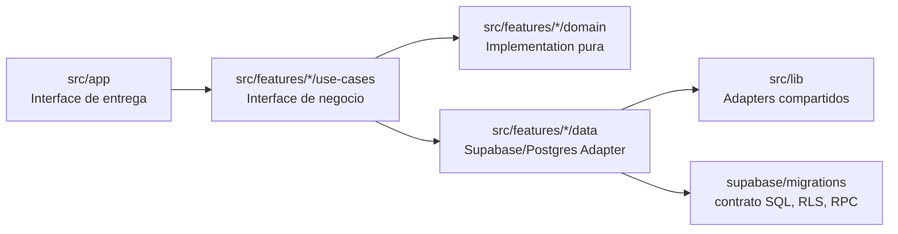
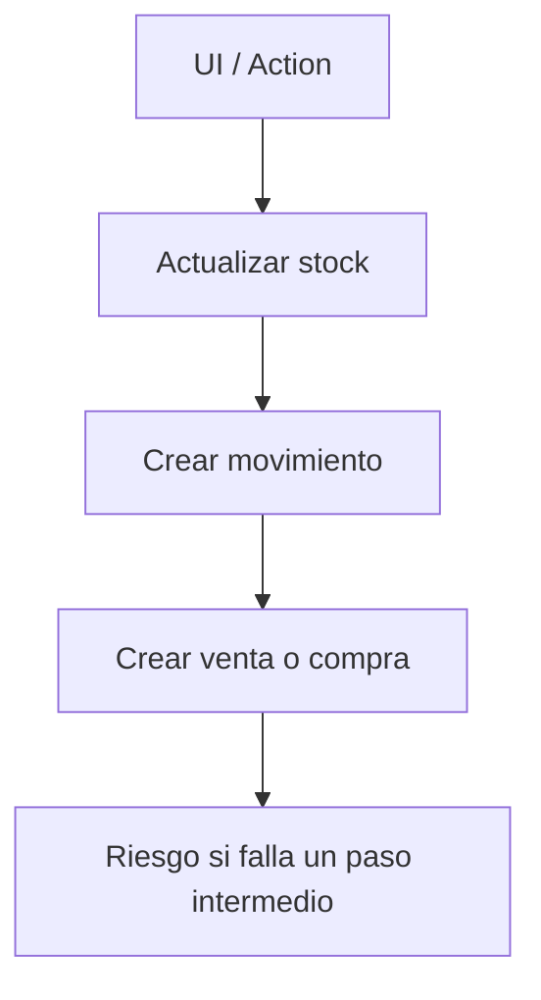
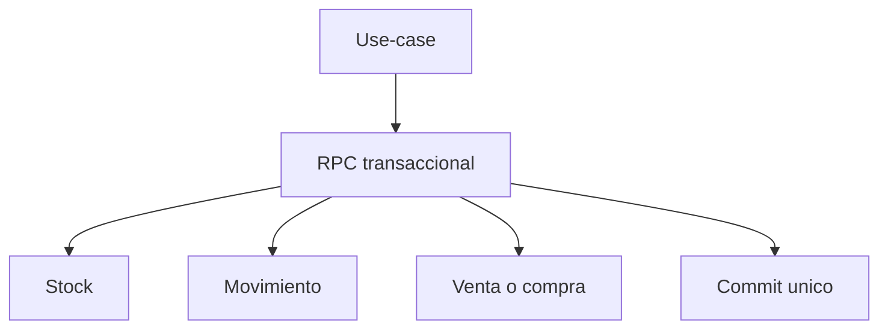
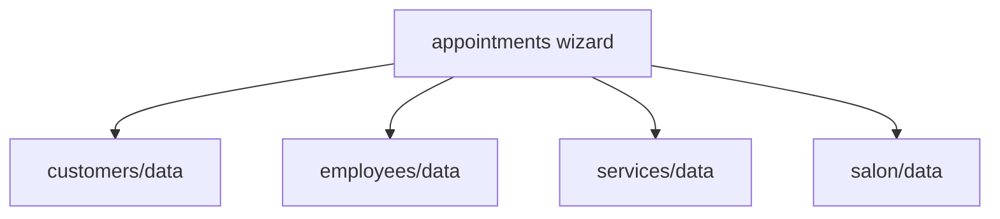
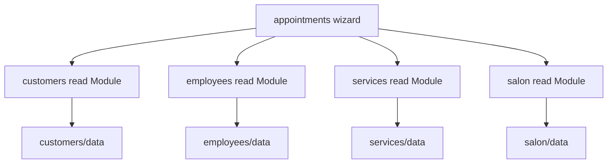

# Evaluacion De Arquitectura Modular - 2026-06-03

## Objetivo

Este documento describe la arquitectura que GlowBook esta usando hoy, evalua que tan bien esta implementada y propone mejoras para sostener un monolito modular con baja deuda tecnica, buena separacion de responsabilidades y Modules mas profundos.

La conclusion principal es: no conviene cambiar a microservicios ni rehacer carpetas por estetica. La arquitectura correcta ya esta elegida en ADR 0009. El siguiente salto esta en profundizar algunos Modules, reducir acoplamiento entre features y mantener guardrails automaticos.

## Fuentes Revisadas

- `CONTEXT.md`
- `docs/adr/0001-multi-tenant-rls.md`
- `docs/adr/0009-modular-monolith-feature-architecture.md`
- `docs/adr/0010-server-only-admin-adapter-exceptions.md`
- `docs/architecture-audit-current-state-2026-06-03.md`
- `docs/architecture-improvement-phases-2026-06-03.md`
- `scripts/check-architecture.mjs`
- `package.json`
- `src/app`
- `src/features`
- `src/components`
- `src/lib`
- `supabase/migrations`

Verificaciones ejecutadas:

```text
npm.cmd run architecture:check
npm.cmd run type-check
```

Resultado:

```text
Architecture guardrails passed.
type-check passed.
```

## Arquitectura Actual

GlowBook usa un monolito modular feature-first sobre Next.js App Router y Supabase.

El flujo esperado es:



Esta arquitectura esta alineada con ADR 0009:

- `src/app` es la Interface de entrega: rutas, layouts, Server Actions y UI local de ruta.
- `src/features/<domain>` contiene los Modules de negocio.
- `domain/` contiene reglas puras sin Next, React ni Supabase.
- `data/` contiene Adapters concretos hacia Supabase/Postgres.
- `use-cases/` orquesta validacion, reglas de dominio y persistencia.
- `src/lib` contiene infraestructura compartida, no reglas de negocio.
- `supabase/migrations` es la fuente de verdad para tablas, RLS, RPCs y constraints.

## Organizacion De Carpetas

La organizacion actual es buena para un monolito modular:

```text
src/app
  Rutas, layouts, paginas, Server Actions y UI especifica de ruta.

src/features
  Modules del dominio: access, appointments, customers, dashboard,
  employees, expenses, feedback, finance, inventory, notifications,
  platform, reminders, reports, retail, salon, services.

src/components
  UI compartida y layout. `components/ui` debe seguir libre de dominio.

src/lib
  Infraestructura comun: Supabase, auth/session, permisos, Result,
  errores, fechas, telefono y observabilidad.

supabase/migrations
  Contrato persistente: tablas, RLS, permisos, RPCs y operaciones atomicas.

docs/adr
  Decisiones arquitectonicas que no deben reabrirse sin una razon fuerte.
```

El proyecto tiene 16 feature Modules y alrededor de 187 archivos dentro de `src/features`. Ese volumen justifica el monolito modular: la app ya supero el punto donde una arquitectura solo por rutas seria facil de mantener.

## Evaluacion General

Calificacion actual estimada:

| Dimension | Estado | Nota |
| --- | --- | --- |
| Direccion arquitectonica | Fuerte | ADR 0009 define claramente el monolito modular. |
| Separacion `app -> use-cases -> data/domain` | Buena | El guardrail automatico pasa. |
| Pureza de `domain/` | Fuerte | Hay Modules puros como agenda, disponibilidad, stock y dinero operativo. |
| Seguridad multi-tenant | Fuerte | RLS es la autoridad final y `service_role` esta restringido por ADR 0010. |
| Locality por feature | Buena | La mayoria de cambios del dominio viven en `src/features`. |
| Profundidad de Modules | Buena con oportunidades | Algunos use-cases siguen actuando como ensambladores de repos ajenos. |
| UI route-local | Mejorada | Inventario, gastos y vitrina ya fueron divididos en Modules locales mas pequenos. |
| Riesgo de deuda tecnica | Medio-bajo | El riesgo principal ya no es estructura, sino acoplamientos de lectura y flujos grandes. |

## Lo Que Esta Bien Implementado

### 1. Decision Arquitectonica Clara

ADR 0009 registra una decision correcta: GlowBook debe seguir siendo un monolito modular. Esto evita la complejidad operativa de microservicios y conserva una sola unidad de deploy, pero mejora la Locality al organizar el negocio por Modules.

### 2. Guardrails Automaticos

`scripts/check-architecture.mjs` protege reglas importantes:

- `domain/` no puede importar Supabase, Next, React ni `server-only`.
- `components` no puede importar rutas ni Adapters Supabase.
- `src/app` no puede importar `features/*/data` directamente.
- `service_role` y Auth Admin solo pueden usarse desde Adapters autorizados.
- Directorios vacios de features no deben existir sin README.

Esto es una senal fuerte porque la arquitectura no depende solo de memoria humana.

### 3. RLS Como Seccion De Seguridad Principal

ADR 0001 establece que el aislamiento multi-tenant vive en Supabase RLS. El codigo filtra por `salon_id`, pero la garantia de seguridad esta en la base de datos. Es una decision correcta para un SaaS multi-tenant.

### 4. Excepciones Privilegiadas Auditables

ADR 0010 limita el uso de `service_role` y Auth Admin a una lista corta de Adapters. Esta decision reduce mucho el riesgo de que un Module normal del Salon salte RLS por conveniencia.

### 5. Modules Atomicos Para Stock, Compras Y Vitrina

La migracion `20240101000043_inventory_retail_atomic_operations.sql` profundiza bien los Modules de inventario y vitrina. Operaciones como transferencia, compra de inventario y venta de vitrina ahora viven detras de RPCs transaccionales.

Antes:



Despues:



Este cambio aumenta Depth: la Interface TypeScript es pequena y la Implementation compleja queda concentrada en Postgres.

### 6. Read Model De Dinero Operativo

`src/features/finance` mejora el acoplamiento de dashboard y reportes. El concepto de ingreso operativo, egreso operativo, utilidad estimada y resumen financiero operativo ya vive en `CONTEXT.md`.

Esto es una buena direccion porque dashboard y reportes no deberian conocer cada detalle tecnico de vitrina, gastos y compras de inventario.

### 7. UI De Inventario, Gastos Y Vitrina Mas Local

Los managers recientes quedaron como coordinadores, no como archivos gigantes que contienen todos los formularios y listados. Ejemplos:

- `src/app/(dashboard)/inventory/inventory-manager.tsx`
- `src/app/(dashboard)/expenses/expenses-manager.tsx`
- `src/app/(dashboard)/retail/retail-manager.tsx`

Esto mejora Single Responsibility en la capa de entrega sin mover UI especifica de ruta a `components/ui`.

## Friccion Arquitectonica Encontrada

### 1. Use-cases Que Importan Repos De Otras Features

Hay use-cases que ensamblan vistas importando `data/` de varios Modules:

- `src/features/appointments/use-cases/get-appointment-wizard-data.ts`
- `src/features/reminders/use-cases/get-reminder-queue.ts`
- `src/features/employees/use-cases/get-employees-page.ts`
- `src/features/retail/use-cases/retail-sales.ts`
- `src/features/dashboard/use-cases/get-dashboard-overview.ts`
- `src/features/finance/use-cases/operational-money.ts`

Esto no rompe el guardrail actual, pero reduce Locality. Cuando un Module consume repos ajenos, conoce query shape y detalles de persistencia que pertenecen a otro Module.

Ejemplo:

```text
retail/use-cases/retail-sales.ts
  importa customers/data/customers.repo
  importa inventory/use-cases/retail-inventory-products
```

La segunda dependencia esta mejor que la primera: inventario expone una Interface estrecha para productos vendibles, mientras que customers aun se consume desde su Adapter de persistencia.

Mejora recomendada: crear Interfaces estrechas de lectura en el Module propietario antes de importar repos ajenos.

### 2. Page View Modules Con Demasiadas Fuentes

`appointments`, `reminders` y `employees` tienen use-cases de pagina que necesitan muchas fuentes: clientes, colaboradores, salon, servicios, roles, plantillas y citas.

Esto es normal para pantallas operativas, pero el riesgo es que el use-case se vuelva un mini-orquestador con conocimiento de demasiadas Implementations.

El problema no es que un flujo cruce dominios. El problema aparece cuando ese cruce se hace contra Adapters concretos en vez de Interfaces de lectura mas pequenas.

### 3. `services-manager.tsx` Sigue Grande

Entre los archivos de `src/app`, `services-manager.tsx` sigue siendo el candidato mas visible para dividir. Tiene alrededor de 473 lineas y mezcla bastante estado visual.

No es una violacion de arquitectura, pero si una oportunidad de Single Responsibility en UI route-local.

### 4. `architecture-health.mjs` Tiene Referencias Historicas

`scripts/architecture-health.mjs` todavia espera documentos historicos en rutas antiguas, mientras `docs/README.md` ya indica que esos documentos viven en `docs/archive/architecture-history/`.

No afecta runtime, pero puede dar falsos `MISSING` en un reporte de salud arquitectonica. Conviene actualizarlo para que mida el estado documental vigente.

### 5. El Guardrail No Detecta Todo El Acoplamiento Entre Features

El guardrail actual detecta violaciones fuertes, pero no marca como advertencia los imports cross-feature hacia `data/`.

Eso esta bien como punto de partida, porque algunas dependencias son aceptables. Pero el siguiente nivel seria diferenciar:

- permitido: `feature A -> feature B/use-cases/read-module`
- advertencia: `feature A -> feature B/data`
- permitido con ADR o README: excepciones load-bearing

## Analisis SOLID

### Single Responsibility

Estado: bueno.

La responsabilidad principal esta bien separada:

- entrega en `src/app`,
- negocio en `src/features`,
- infraestructura en `src/lib`,
- persistencia/RLS/RPC en `supabase/migrations`.

Debilidad: algunos use-cases de pagina tienen demasiadas fuentes y algunos Modules UI aun son grandes.

### Open/Closed

Estado: bueno.

Agregar un nuevo flujo suele implicar crear o extender un feature Module sin reordenar toda la app. Feature flags y permisos dinamicos ayudan a abrir funcionalidad sin hardcodear roles.

Debilidad: dashboard, reportes y page views deben editarse cuando aparece una nueva fuente operativa. `finance` ya redujo este riesgo para dinero.

### Liskov Substitution

Estado: sin riesgo importante.

No hay jerarquias o herencia compleja. El riesgo de este principio es bajo.

### Interface Segregation

Estado: aceptable, con oportunidad clara.

El proyecto ya empezo a crear Interfaces estrechas:

- productos vendibles para vitrina,
- opciones de productos para gastos,
- resumen de stock bajo,
- resumen financiero operativo.

El siguiente paso es aplicar el mismo patron a clientes, colaboradores, roles, salon y plantillas cuando otro Module solo necesita una lectura pequena.

### Dependency Inversion

Estado: correcto para el tamano actual.

No conviene crear abstracciones artificiales para cada repo. Un solo Adapter es un Seam hipotetico, no necesariamente real. Donde si hay presion real es en use-cases que cruzan features y en operaciones transaccionales.

## Candidatos De Mejora

### Candidato 1: Interfaces De Lectura Entre Features

Fuerza: Strong.

Files:

- `src/features/appointments/use-cases/get-appointment-wizard-data.ts`
- `src/features/reminders/use-cases/get-reminder-queue.ts`
- `src/features/employees/use-cases/get-employees-page.ts`
- `src/features/retail/use-cases/retail-sales.ts`
- `src/features/customers/use-cases/*`
- `src/features/employees/use-cases/*`
- `src/features/salon/use-cases/*`
- `src/features/services/use-cases/*`

Problema:

Varios use-cases importan repos de otras features. Eso hace que el caller conozca la Implementation de persistencia ajena y reduce Locality.

Solucion:

Crear read Modules estrechos en la feature propietaria. Ejemplos:

- `customers/use-cases/customer-options.ts`
- `employees/use-cases/employee-options.ts`
- `services/use-cases/service-catalog-options.ts`
- `salon/use-cases/salon-scheduling-config.ts`

Antes:



Despues:



Beneficio:

- Mas Locality en cada Module propietario.
- Menos conocimiento de query shape ajena.
- Tests mas claros sobre Interfaces de lectura.
- Mejor cumplimiento de Interface Segregation.

### Candidato 2: Dividir `services-manager.tsx`

Fuerza: Worth exploring.

Files:

- `src/app/(dashboard)/services/services-manager.tsx`
- `src/app/(dashboard)/services/*`

Problema:

El manager de servicios sigue siendo uno de los archivos mas grandes de `src/app`. Puede concentrar tabs, formularios, listados, estados y acciones visuales.

Solucion:

Mantenerlo como coordinador y extraer UI route-local:

- `ServicesStats`
- `ServicesTabs`
- `CategoryForm`
- `ServiceForm`
- `ServicesList`
- `CategoryList`

Beneficio:

- Mejor Single Responsibility.
- Cambios visuales mas localizados.
- Menos riesgo al editar catalogo operativo.

### Candidato 3: Guardrail Para Imports Cross-Feature

Fuerza: Worth exploring.

Files:

- `scripts/check-architecture.mjs`
- `docs/adr/0009-modular-monolith-feature-architecture.md`

Problema:

El guardrail actual evita violaciones fuertes, pero no advierte cuando una feature importa `data/` de otra feature.

Solucion:

Agregar warnings, no fallos, para imports de este estilo:

```text
src/features/A/use-cases/* -> src/features/B/data/*
```

Permitir excepciones documentadas cuando el acoplamiento sea intencional.

Beneficio:

- Hace visible la deuda antes de que crezca.
- No bloquea desarrollo normal.
- Empuja a crear Interfaces estrechas cuando hay presion real.

### Candidato 4: Actualizar `architecture-health.mjs`

Fuerza: Strong.

Files:

- `scripts/architecture-health.mjs`
- `docs/README.md`

Problema:

El script de salud arquitectonica todavia revisa documentos antiguos que ahora fueron archivados. Puede reportar faltantes aunque la documentacion vigente este correcta.

Solucion:

Actualizar la lista de documentos esperados para reflejar:

- auditoria vigente,
- fases vigentes,
- archivo historico,
- ADRs principales,
- runbooks actuales.

Beneficio:

- Menos falsos positivos.
- Mejor confianza en reportes de arquitectura.
- Documentacion viva alineada con `docs/README.md`.

### Candidato 5: Profundizar `finance` Como Read Model Operativo

Fuerza: Speculative.

Files:

- `src/features/finance/use-cases/operational-money.ts`
- `src/features/finance/domain/operational-money.ts`
- `src/features/dashboard/use-cases/get-dashboard-overview.ts`
- `src/features/reports/use-cases/get-operational-report.ts`

Problema:

`finance` ya concentra dinero externo, pero todavia importa repos concretos de gastos, inventario y vitrina. Esto puede estar bien por ahora, porque su razon de existir es integrar fuentes de dinero. La pregunta es si el Seam ya merece Adapters mas explicitos por fuente.

Solucion posible:

Mantener `finance` como Interface unica para dashboard/reportes, pero mover cada fuente a pequenos read Modules del propietario:

- `retail/use-cases/retail-revenue.ts`
- `expenses/use-cases/manual-expense-total.ts`
- `inventory/use-cases/inventory-purchase-total.ts`

Beneficio:

- Mayor Locality de formulas por fuente.
- `finance` queda como coordinador de dinero operativo, no como lector directo de tablas ajenas.

No lo haria primero porque el Module actual ya redujo bastante acoplamiento. Conviene esperar a que el read model crezca.

## Recomendacion Principal

La mejor siguiente mejora es crear Interfaces de lectura entre features y luego agregar warnings suaves al guardrail.

Orden recomendado:

1. Crear read Modules estrechos para clientes, colaboradores, servicios y salon cuando son consumidos por citas, recordatorios, empleados o vitrina.
2. Cambiar los use-cases orquestadores para consumir esas Interfaces, no repos ajenos.
3. Agregar warnings en `scripts/check-architecture.mjs` para imports cross-feature hacia `data/`.
4. Actualizar `scripts/architecture-health.mjs` para que refleje la documentacion vigente.
5. Dividir `services-manager.tsx` si se va a seguir trabajando en catalogo operativo.

## Decision Sobre Cambiar Arquitectura

No recomiendo cambiar la arquitectura base.

No recomiendo:

- microservicios,
- carpetas por tipo tecnico como arquitectura principal,
- repositorios globales compartidos por toda la app,
- una capa generica de servicios para todo,
- abstracciones para cada repo sin una segunda Implementation real.

Si recomiendo:

- mantener el monolito modular,
- profundizar Modules con Interfaces mas pequenas,
- sostener `app -> use-cases -> domain/data`,
- usar RPCs transaccionales para operaciones irreversibles,
- mantener RLS como autoridad de aislamiento,
- dejar `components/ui` libre de dominio,
- mover UI especifica de ruta solo dentro de su ruta,
- documentar excepciones con ADR cuando sean load-bearing.

## Estado Final

GlowBook esta bien encaminado. La arquitectura actual ya se comporta como monolito modular y tiene guardrails reales. El proyecto no necesita una reestructuracion grande: necesita seguir convirtiendo Modules superficiales en Modules profundos, especialmente donde una pantalla o use-case cruza varios conceptos del dominio.

La metrica practica para avanzar es:

```text
Si un caller necesita saber demasiado sobre la Implementation de otro Module,
crear una Interface estrecha en el Module propietario.
```

Ese criterio mantiene el codigo facil de navegar, reduce deuda tecnica y alinea mejor el proyecto con SOLID sin sobrearquitectura.
